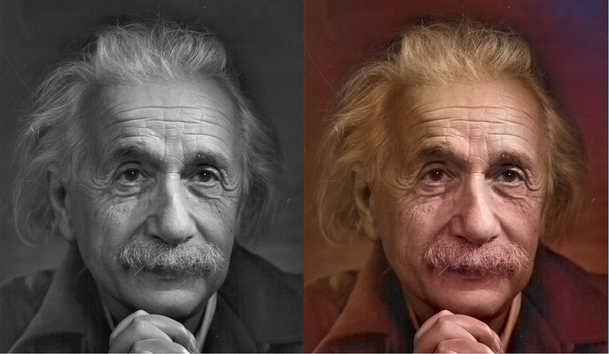
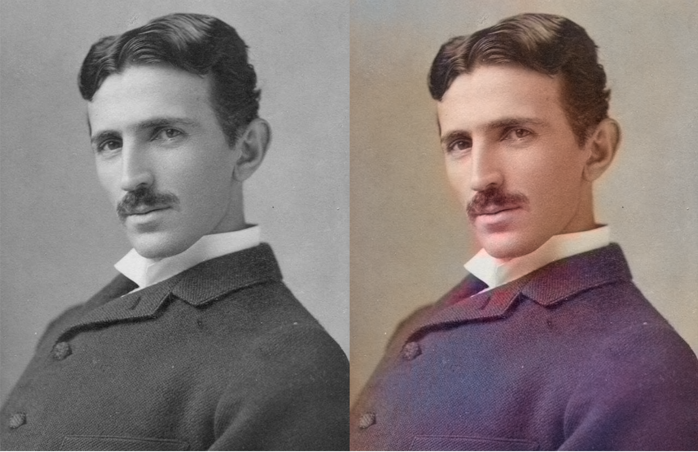
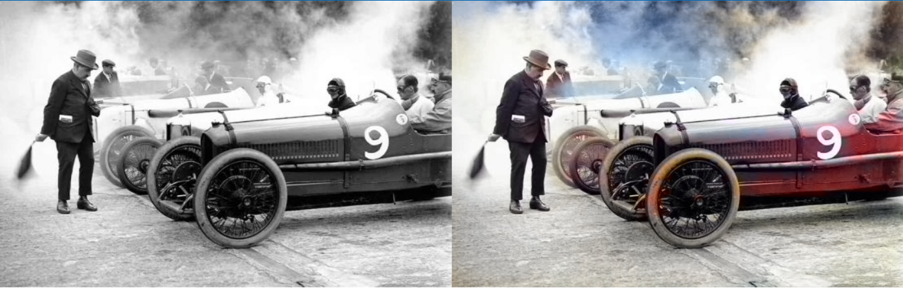

# Black and White Image Colorization

Transform your old black and white photos into vibrant colored images using the power of deep learning! This project uses an advanced neural network to automatically predict and apply realistic colors to grayscale images.


---

## About This Project

This colorization tool brings old memories back to life by automatically adding colors to black and white photographs. Using a pre-trained deep learning model based on the research paper **"Colorful Image Colorization"** by Zhang et al., this project can intelligently predict what colors should be applied to different parts of an image.

The algorithm analyzes the content of the image (people, objects, landscapes) and applies colors based on patterns learned from millions of colored images during training.

---

## Features

- **Automatic Colorization** - No manual work required, just run the script
- **Batch Processing** - Colorize multiple images at once
- **Side-by-Side View** - Compare original and colorized images instantly
- **Easy to Use** - Simple Python script with clear instructions
- **Pre-trained Model** - Uses state-of-the-art colorization algorithm

---

## Example Results

See the magic in action! Below are some examples of black and white images that have been automatically colorized:

### Albert Einstein


*The legendary physicist vintage B&W photo, now in color!*

---

### Nikola Tesla


*The brilliant inventor brought to life with color*

---

### Portrait of a Child


*Capturing childhood memories in vibrant colors*

---

### Classic Racing Automobile


*Vintage cars look stunning when colorized*

---

### My Image


*Various subjects can be automatically colorized*

---

## Requirements

Before running the project, make sure you have:

- **Python 3.6** or higher
- **OpenCV** library
- **NumPy** library

---

## Installation

Follow these simple steps to get started:

### Step 1: Clone the Repository

```bash
git clone https://github.com/YOUR_USERNAME/image-colorization.git
cd image-colorization
```

### Step 2: Install Dependencies

```bash
pip install opencv-python numpy
```

Or install from requirements file:

```bash
pip install -r requirements.txt
```

### Step 3: Download Model Files

Download these three files and place them in the `model/` folder:

- `colorization_deploy_v2.prototxt`
- `colorization_release_v2.caffemodel` (125 MB)
- `pts_in_hull.npy`

**Download Links:**
- GitHub Repository: [https://github.com/richzhang/colorization/tree/caffe/colorization/models](https://github.com/richzhang/colorization/tree/caffe/colorization/models)
- Direct Download: [colorization_release_v2.caffemodel](https://www.dropbox.com/s/dx0qvhhp5hbcx7z/colorization_release_v2.caffemodel)

---

## Usage

### Colorize a Single Image

1. Place your black and white image in the project folder
2. Open `colorize.py` and modify this line:
   ```python
   input_img = "your_image.jpg"  # Change to your image name
   ```
3. Run the script:
   ```bash
   python colorize.py
   ```
4. Find your colorized image saved as `output_colorized.jpg`
5. A preview window will also show the before/after comparison

### Batch Processing Multiple Images

1. Create a folder named `input_images` in the project directory
2. Place all your black and white images inside this folder
3. Run the script:
   ```bash
   python colorize.py
   ```
4. All colorized images will be saved in the `output_images/` folder with the prefix "colorized_"

---

## Project Structure

```
image-colorization/
│
├── colorize.py                    # Main colorization script
├── README.md                      # Project documentation (this file)
├── requirements.txt               # Python dependencies
│
├── model/                         # Model files (download separately)
│   ├── colorization_deploy_v2.prototxt
│   ├── colorization_release_v2.caffemodel
│   └── pts_in_hull.npy
│
├── examples/                      # Example before/after images
│   ├── Einstein.png
│   ├── tesla.png
│   ├── kid.png
│   ├── car.png
│   └── image.png
│
├── input_images/                  # Place your images here for batch processing
└── output_images/                 # Colorized results will be saved here
```

---

## How It Works

The colorization process follows these steps:

1. **Input Processing**: The grayscale image is converted to LAB color space
2. **Lightness Extraction**: The L channel (lightness) is separated from the image
3. **Neural Network Prediction**: A deep convolutional neural network predicts the A and B color channels
4. **Color Reconstruction**: The predicted color channels are combined with the original lightness
5. **Output Conversion**: The image is converted back to RGB format and saved

The neural network was trained on over 1 million images and learned to associate objects, textures, and scenes with appropriate colors.

---

## Technical Details

- **Model Architecture**: CNN-based encoder-decoder network
- **Color Space**: LAB (perceptually uniform color space)
- **Input Size**: 224x224 pixels (resized internally)
- **Framework**: Caffe (via OpenCV DNN module)
- **Output Format**: BGR color image (OpenCV standard)

---

## Best Results

The colorization works best on:

-  Historical photographs of people
-  Portraits and faces
-  Natural landscapes and outdoor scenes
-  Animals and wildlife
-  Vintage cars and architecture

May not work as well on:

-  Abstract art or graphics
-  Very low quality or damaged images
-  Images with unusual or artistic content
-  Text-heavy documents

---

## Troubleshooting

### "Model files not found" Error

**Solution:**
- Verify all three model files are in the `model/` folder
- Check that file names match exactly (case-sensitive)
- Re-download files if they seem corrupted

### "Can't read image" Error

**Solution:**
- Ensure the image file exists in the specified location
- Check that the file extension is supported (jpg, png, bmp)
- Try using an absolute path instead of relative path

### Poor Colorization Results

**Solution:**
- The model works best on natural photos
- Try different images with clearer subjects
- Ensure the input image has good contrast
- Some images may require manual touch-ups after colorization

### Program Runs Slowly

**Solution:**
- First run loads the model, which takes time
- Subsequent colorizations will be faster
- Large images take longer to process
- Consider resizing very large images before processing

---

## References & Credits

This project is based on the groundbreaking research:

**Paper**: "Colorful Image Colorization"  
**Authors**: Richard Zhang, Phillip Isola, Alexei A. Efros  
**Institution**: University of California, Berkeley  
**Published**: ECCV 2016  
**Paper Link**: [https://arxiv.org/abs/1603.08511](https://arxiv.org/abs/1603.08511)

**Original Implementation**: [https://github.com/richzhang/colorization](https://github.com/richzhang/colorization)

---

## Author

**HADI SARHANGI FARD**

Feel free to reach out for questions, suggestions, or collaborations!

- find me in linkedin: www.linkedin.com/in/hadi-sarhangi-fard-mech-eng
---

## License

This project is open source and available for educational and research purposes.

The pre-trained model is provided by the original authors and is subject to their license terms.

---

## Contributing

Contributions are welcome! If you have ideas for improvements:

1. Fork the repository
2. Create a new branch (`git checkout -b feature-improvement`)
3. Make your changes
4. Commit your changes (`git commit -am 'Add new feature'`)
5. Push to the branch (`git push origin feature-improvement`)
6. Create a Pull Request

---

## Future Enhancements

Ideas for future development:

- [ ] Add a graphical user interface (GUI)
- [ ] Support for video colorization
- [ ] Real-time colorization with webcam
- [ ] Multiple model options for different styles
- [ ] Color intensity adjustment slider
- [ ] Option to manually adjust colors in specific regions
- [ ] Export to different image formats
- [ ] Mobile app version

---

## Show Your Support

If you found this project helpful or interesting, please consider giving it a star on GitHub! It helps others discover the project and motivates further development.

---

## Contact & Feedback

Have questions or feedback? Feel free to:
- Open an issue on GitHub
- Submit a pull request with improvements
- Share your colorization results!
---

** Happy Colorizing! **

*Bringing the past to life, one image at a time.*
